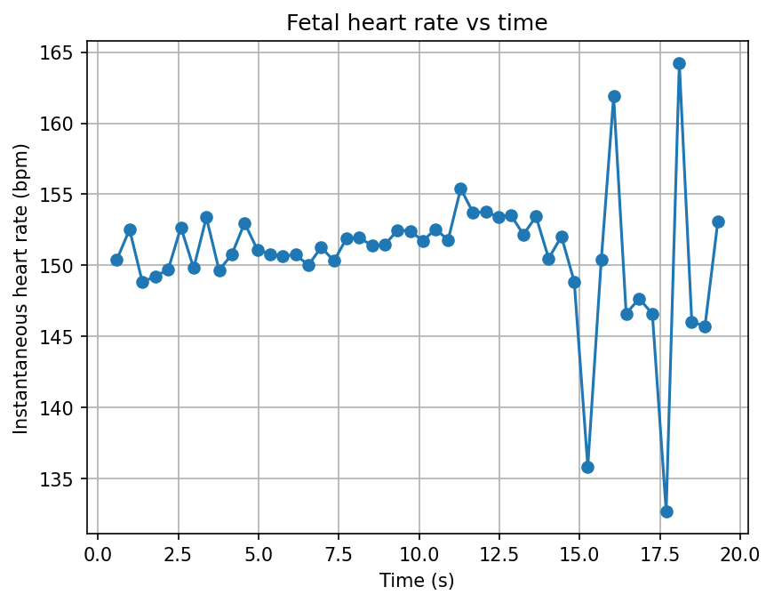
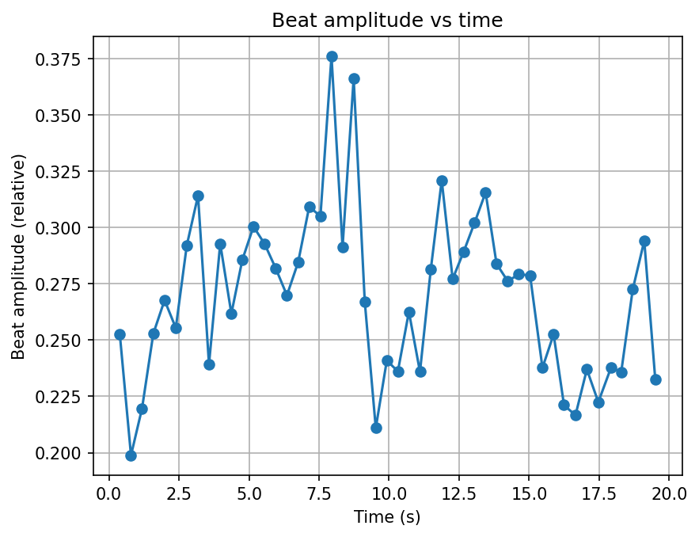
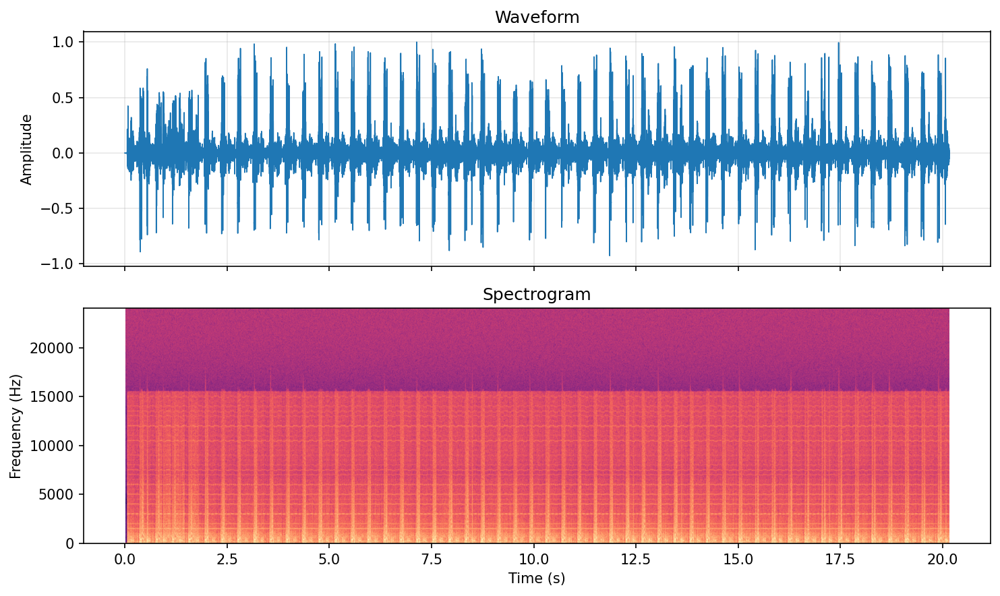

# Mango Heartbeat Analysis

Tools for exploring a fetal heartbeat recording captured with a **JPD-100S (mini) AngelSounds Fetal Doppler**. The scripts extract beat-to-beat timing, compute HR/HRV-style metrics, and generate easy-to-share plots. The project is purely for curiosity and bonding with the baby — it is **not** a diagnostic or medical instrument.

## Features
- Detect fetal heart beats from a WAV file and estimate BPM along the clip.
- Compute time-domain metrics: average/median BPM, standard deviation, period (RR interval) statistics, SDNN, RMSSD, and amplitude-based summaries.
- Persist all metrics to a timestamped CSV that matches the source WAV file’s modification time.
- Produce plots for instantaneous heart rate, beat-amplitude trends, and a Praat-inspired stacked waveform + spectrogram view.

## Requirements
- Python 3.9+
- `numpy`, `scipy`, `matplotlib`

Install dependencies (e.g., inside a virtual environment):

```bash
pip install numpy scipy matplotlib
```

## Usage

```bash
python fetal_bpm.py path/to/heartbeat.wav          # analysis + CSV
python fetal_bpm.py --plot path/to/heartbeat.wav   # analysis + CSV + plots
```

Outputs are written next to the WAV file:
- `<wavname>_<timestamp>_metrics.csv` with a single row of all computed metrics.
- `<wavname>_hr.png` and `<wavname>_amp.png` when `--plot` is provided.
- `<wavname>_wave_spec.png` delivering the waveform stacked above a spectrogram for a Praat-like vibe.

### Example Plots







### Example Output

```
(asr) gabriel@gabriel-ThinkPad-T495:~/Data/_Python_projects/mango_heartbeat_analysis$ python fetal_bpm.py --plot mango_heartbeat_20225_nov20.wav
Clip duration                : 20.16 s
Detected beats (total)       : 51
Beats used for stats (inner) : 49

Heart rate (from inner beats):
  Mean HR                    : 150.8 bpm
  Median HR                  : 151.3 bpm
  Std HR                     : 4.8 bpm
  Min / Max HR               : 132.7 / 164.2 bpm

Beat period T (inner intervals):
  Mean T                     : 0.398 s
  Median T                   : 0.396 s
  Std T                      : 0.013 s
  CV T (std/mean)            : 0.033

Beat-interval variation (HRV-like measures):
  SDNN  (overall timing spread)   : 0.013 s
  RMSSD (beat-to-beat jitter)     : 0.020 s

Beat amplitude (inner beats, 0–1 scale):
  Mean amplitude              : 0.270
  Median amplitude            : 0.272
  Std amplitude               : 0.037
  Min / Max amplitude         : 0.199 / 0.376
  CV (std/mean)               : 0.137

Metrics saved to             : mango_heartbeat_20225_nov20_20251121_124354_metrics.csv

Plots saved:
  Heart rate vs time    -> mango_heartbeat_20225_nov20_hr.png
  Amplitude vs time     -> mango_heartbeat_20225_nov20_amp.png
  Wave + spectrogram    -> mango_heartbeat_20225_nov20_wave_spec.png
```

## Notes
- The recording comes from a JPD-100S AngelSounds Fetal Doppler (mini). Hardware quirks and background noise can affect peak detection — feel free to tweak the script if you have other recordings.
- Again, this repository is **not** meant to diagnose or replace professional fetal monitoring. It is for fun experimentation and keeping an eye on trends over time.
